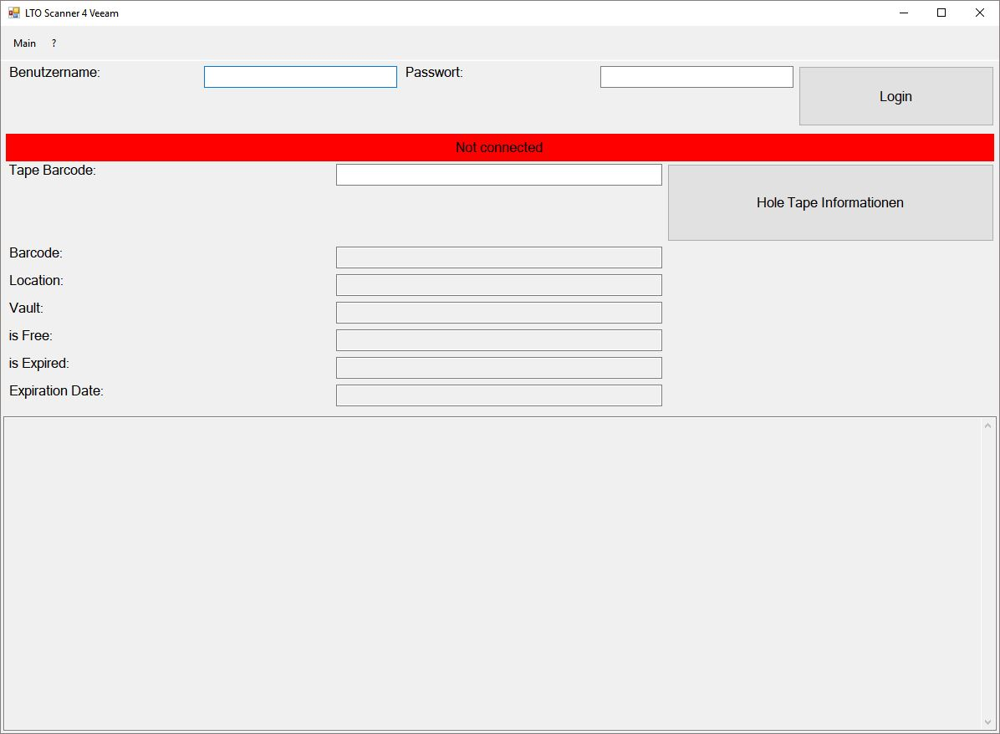
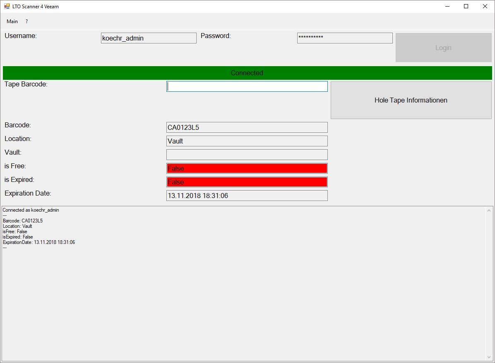

# lto-scanner4veeam
This C# Windows Forms Application is a tool to show the information about LTO tapes from your "Veeam Backup & Replication" server.
## Settings
The program delivers a default settings file. Before you start you have to edit these settings and name your backupserver. The domain is optional.
## About
To use this tool you need an installation of Veeam Backup & Replication. We are only using the given PowerShell Snapin. For more information about Veeam and Veeam Backup & Replication visit https://veeam.com
The program will not start without the required PowerShell Snapin.
## Screenshots

